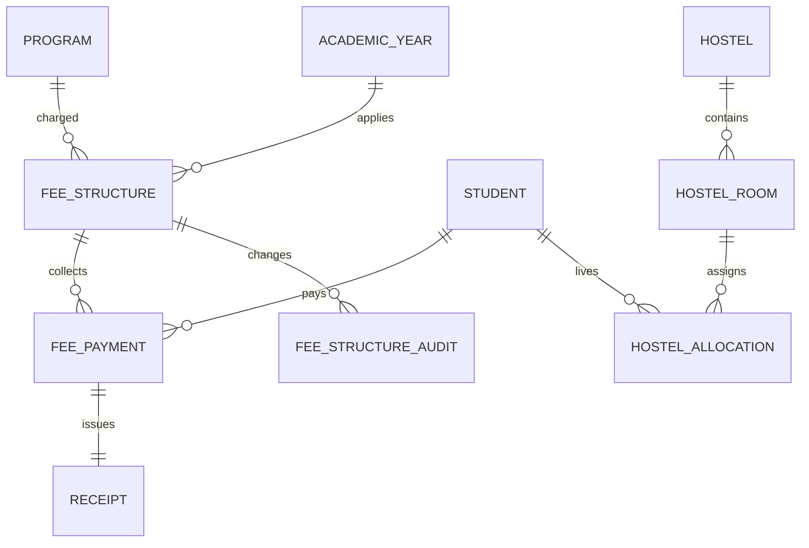

# Administration ER diagram

```mermaid
erDiagram
  PROGRAM ||--o{ FEE_STRUCTURE : charged
  ACADEMIC_YEAR ||--o{ FEE_STRUCTURE : applies
  FEE_STRUCTURE ||--o{ FEE_PAYMENT : collects
  STUDENT ||--o{ FEE_PAYMENT : pays
  FEE_PAYMENT ||--|| RECEIPT : issues
  FEE_STRUCTURE ||--o{ FEE_STRUCTURE_AUDIT : changes
  HOSTEL ||--o{ HOSTEL_ROOM : contains
  HOSTEL_ROOM ||--o{ HOSTEL_ALLOCATION : assigns
  STUDENT ||--o{ HOSTEL_ALLOCATION : lives
```
