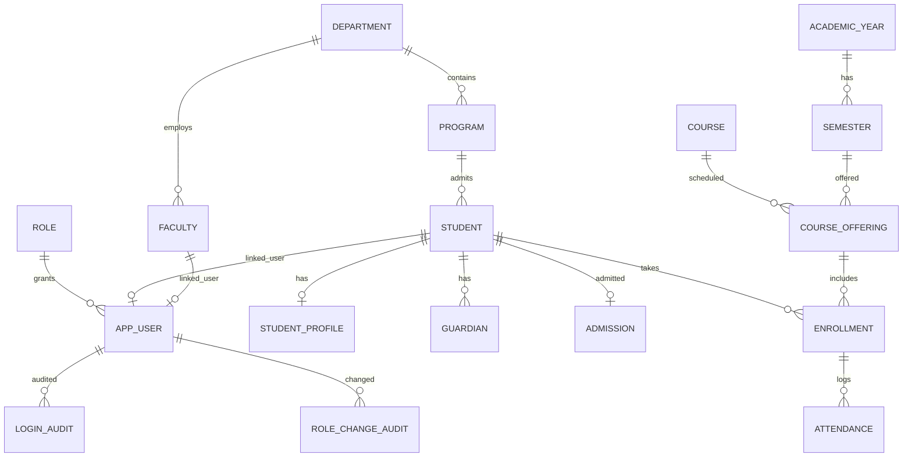

# Common, Authentication, Student ER diagram

```mermaid
erDiagram
  DEPARTMENT ||--o{ PROGRAM : contains
  PROGRAM ||--o{ STUDENT : admits
  DEPARTMENT ||--o{ FACULTY : employs
  ACADEMIC_YEAR ||--o{ SEMESTER : has
  ROLE ||--o{ APP_USER : grants
  STUDENT ||--o| APP_USER : linked_user
  FACULTY ||--o| APP_USER : linked_user
  APP_USER ||--o{ LOGIN_AUDIT : audited
  APP_USER ||--o{ ROLE_CHANGE_AUDIT : changed
  STUDENT ||--o| STUDENT_PROFILE : has
  STUDENT ||--o{ GUARDIAN : has
  STUDENT ||--o| ADMISSION : admitted
  COURSE ||--o{ COURSE_OFFERING : scheduled
  SEMESTER ||--o{ COURSE_OFFERING : offered
  STUDENT ||--o{ ENROLLMENT : takes
  COURSE_OFFERING ||--o{ ENROLLMENT : includes
  ENROLLMENT ||--o{ ATTENDANCE : logs
```
