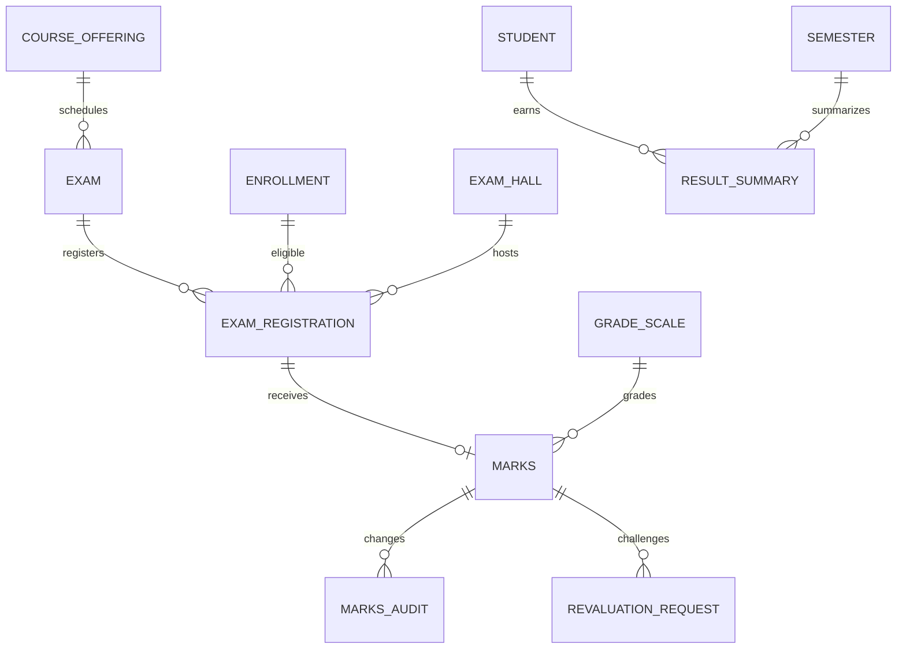

# Examination ER diagram

```mermaid
erDiagram
  COURSE_OFFERING ||--o{ EXAM : schedules
  EXAM ||--o{ EXAM_REGISTRATION : registers
  ENROLLMENT ||--o{ EXAM_REGISTRATION : eligible
  EXAM_HALL ||--o{ EXAM_REGISTRATION : hosts
  EXAM_REGISTRATION ||--o| MARKS : receives
  GRADE_SCALE ||--o{ MARKS : grades
  MARKS ||--o{ MARKS_AUDIT : changes
  STUDENT ||--o{ RESULT_SUMMARY : earns
  SEMESTER ||--o{ RESULT_SUMMARY : summarizes
  MARKS ||--o{ REVALUATION_REQUEST : challenges
```
