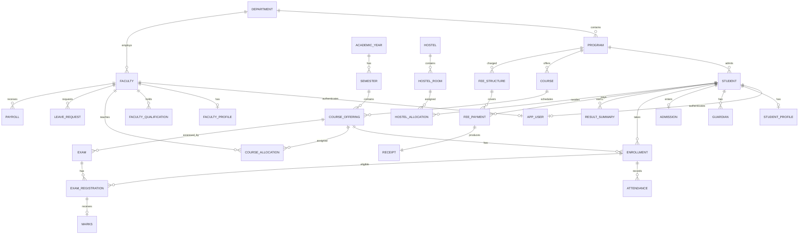

# Master ER diagram

```mermaid
erDiagram
  DEPARTMENT ||--o{ PROGRAM : contains
  PROGRAM ||--o{ STUDENT : admits
  DEPARTMENT ||--o{ FACULTY : employs
  ACADEMIC_YEAR ||--o{ SEMESTER : has
  STUDENT ||--o| APP_USER : authenticates
  FACULTY ||--o| APP_USER : authenticates
  STUDENT ||--o| STUDENT_PROFILE : has
  STUDENT ||--o{ GUARDIAN : has
  STUDENT ||--o| ADMISSION : enters
  PROGRAM ||--o{ COURSE : offers
  COURSE ||--o{ COURSE_OFFERING : schedules
  SEMESTER ||--o{ COURSE_OFFERING : contains
  STUDENT ||--o{ ENROLLMENT : takes
  COURSE_OFFERING ||--o{ ENROLLMENT : has
  ENROLLMENT ||--o{ ATTENDANCE : records
  FACULTY ||--o| FACULTY_PROFILE : has
  FACULTY ||--o{ FACULTY_QUALIFICATION : holds
  FACULTY ||--o{ COURSE_ALLOCATION : teaches
  COURSE_OFFERING ||--o{ COURSE_ALLOCATION : assigned
  FACULTY ||--o{ LEAVE_REQUEST : requests
  FACULTY ||--o{ PAYROLL : receives
  COURSE_OFFERING ||--o{ EXAM : assessed_by
  EXAM ||--o{ EXAM_REGISTRATION : has
  ENROLLMENT ||--o{ EXAM_REGISTRATION : eligible
  EXAM_REGISTRATION ||--o| MARKS : receives
  STUDENT ||--o{ RESULT_SUMMARY : earns
  PROGRAM ||--o{ FEE_STRUCTURE : charged
  STUDENT ||--o{ FEE_PAYMENT : pays
  FEE_STRUCTURE ||--o{ FEE_PAYMENT : covers
  FEE_PAYMENT ||--|| RECEIPT : produces
  HOSTEL ||--o{ HOSTEL_ROOM : contains
  HOSTEL_ROOM ||--o{ HOSTEL_ALLOCATION : assigned
  STUDENT ||--o{ HOSTEL_ALLOCATION : resides
```
